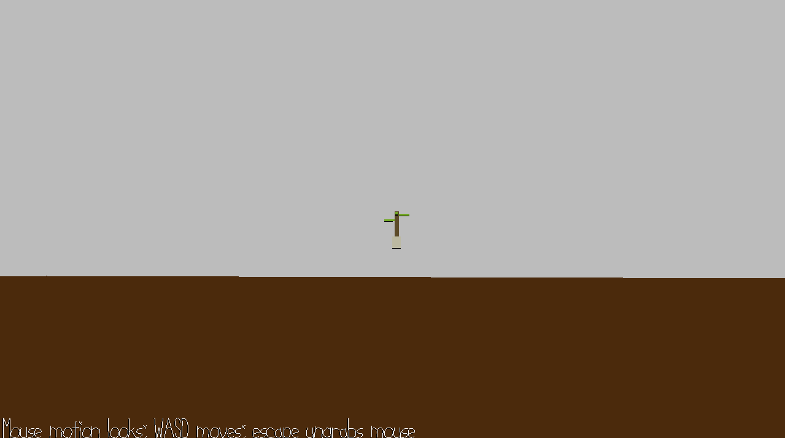

# Escape the Shadow Dimension

Author: Vishant Raajkumar

Design: In this brand new strand-type game from acclaimed game director Vishant "Kojima" Raajkumar, you must use Norman Reedus's
amazing walking skills to escape the shadow dimension and find the plant on the other side.

Screen Shot:

How To Play:

To play, walk around using WASD and look around with the mouse. You may find that my mesh is broken so you can clip through the ground to escape the shadow dimension.

Sources: I made my own broken mesh with incorrect normals

This game was built with [NEST](NEST.md).

